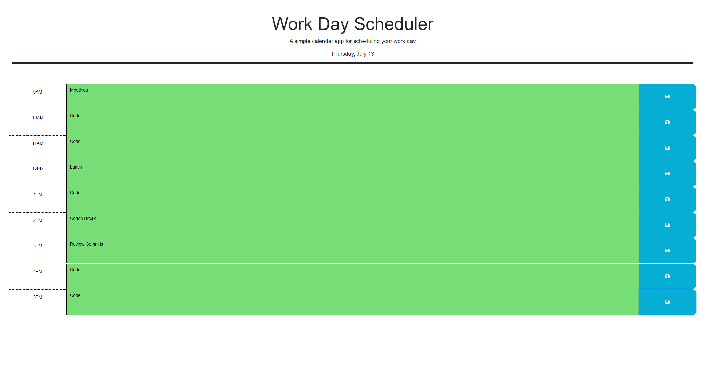

# Work Day Scheduler Starter Code

## Description

As a student I have various duties I need to carry out in order to succeed in becoming a web developer. By building a work day scheduling application I can organize my day with ease and keep track of the tasks I need to accomplish. Building this application taught me how to use various web APIs such as jQuery and Day.js.

# Website

# Link

https://danieltbonn.github.io/work-day-scheduler/

